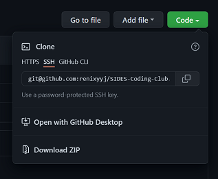
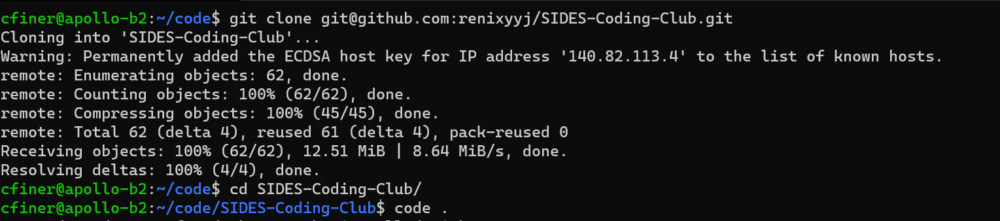

# Welcome to SIDES Coding Club

[Jump to Resources](#useful-online-resources)

### Hosts: 
 - David Evans
 - Stacy Finer
 - Cory Finer
 

`
TLDR; Get ready for next meetup by becoming Git experts in your spare time! Ask your colleagues for help.
`
> ## Notes from April 21, 2022 
> ---
> ### We completed our todo list for the day. Not bad for our first day!
> 
> > - [x] Install and Configure Git <https://git-scm.com/downloads>
> > - [x] Create SSH Keys (run `ssh-keygen` on the command line)
> > - [x] Create GitHub Account (if your reading this, you are done!)
> > - [x] Clone SIDES-Coding-Club (see below)
> > - [x] **Bonus** Install Visual Studio Code and the `Git Graph` extension <https://code.visualstudio.com>
>  
> For cloning the repository I recommend everyone use the SSH option. This allows easy syncronization between your local copies of the projects and the online GitHub copy. From your private fork page, ie github.com/your_name/SIDES-Coding-Club click on the `<> Code` tab and then use the `Code` drop down button like the screenshot below. Select SSH and copy the link. Then on your command line (terminal, git-bash, etc) cd to your code folder (`cd code`) and run `git clone git@github.com:your_name/SIDES-Coding-Club.git`. Windows and Linux users; you can optionally jump right into VSCode by running `code .` (yes that's a dot - it means "this folder"). Mac users open VSCode from the your desktop, select `open folder` and point it to you newly created `SIDES-Coding-Club` folder.
>
> *note: the screenshot of the terminal below uses the renixyyj/... repo. You need to change that to your private fork so that you can contribute your work back to the group* 
>
> 
> 
> 
> Thanks for participating in Coding Club today everyone. Overall I think it started well. I didn't realize until late that we actually finished the checklist so timing worked out. If anyone is having trouble with the install please put a question in the [discussion group](https://github.com/renixyyj/SIDES-Coding-Club/discussions).
>
---
## Useful Online Resources

`
coding club team: learn about pull-requests and then submit your edits to this page;  add links to resources here to share with the group. If you get stuck, don't worry, we will cover pull-requests in the next meetup. Use discussion group in the mean time.
`

### References
- [Pro Git Book](https://git-scm.com/book/en/v2) learn Git from start to finish.
- [Git Reference](https://git-scm.com/docs)
- [Stack Overflow (specific example)](https://stackoverflow.com/questions/9229645/remove-duplicate-values-from-js-array) online comminity of coders helping coders in all languages

### Language Guides
- [Markdown](https://www.markdownguide.org/basic-syntax/) for editting files like this one
- [Python Getting Started](https://www.python.org/about/gettingstarted/)
- [JavaScript Resources](https://developer.mozilla.org/en-US/docs/Web/JavaScript)
- [TypeScript](https://www.typescriptlang.org/docs/handbook/typescript-from-scratch.html)
- [Swift and Apple Development](https://developer.apple.com/swift/)
- [Ruby](https://www.ruby-lang.org/en/)
- [Java](https://docs.oracle.com/javase/tutorial/)
- [C, C++](https://docs.microsoft.com/en-us/cpp/?view=msvc-170)

### Example Code on GitHub
- [Linux](https://github.com/torvalds/linux) written in C
- [VSCode](https://github.com/microsoft/vscode) TypeScript/JavaScript
- [Bitcoin](https://github.com/bitcoin/bitcoin) C++ and Python
- [iPhone Games](#useful-online-resources) anyone find any?
---
### Language Levels
 - high = distant from machine
 - low = close to machine

Low Level | Compiled | Bytecode | Interpreted or *JIT*| Markup 
--        | :--:       | :--: | :--: | :--:
`Assembly Language`| `C`            | `C#` | `JavaScript` | `HTML`
`Machine Language` | `C++`          | `Java` | `Python`   | `CSS`
|                  | `Objective-C`  | `F#` | `PHP`        | `MD`
|                  | `Swift`        |      | `Ruby`       | `LaTeX`
|                  | `BASIC`        |      | `Shell Script`
|                  |                |      | `Powershell`

>## TODO Next Meetup
> ---
> - [ ] Using VSCode (syncing with GitHub, editting, running, debugging code)
> - [ ] Contributing your work to GitHub (commit, push, pull-request)
> - [ ] Submit your ideas to add to this list. Or try to explore git on your own, edit this list and create a pull-request for the group to see.
> - [ ] more to come...
